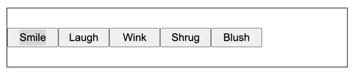
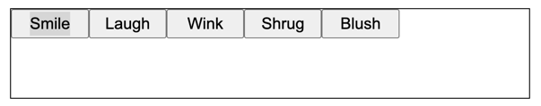
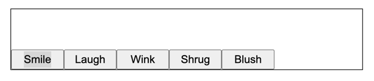
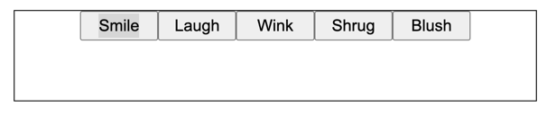
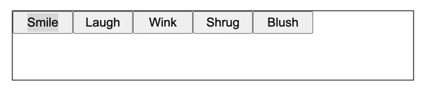
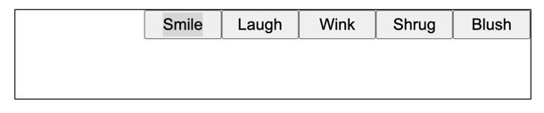
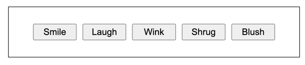

# Flexbox

**Flexbox** - технология, которая предоставляет расширенные возможности для управления поведением блоков в документе

## Зачем нужен flexbox?
- Для вертикального/горизонтального выравнивания содержимого блока
- Для оформления всех детей так, чтобы они распределили между собой доступную ширину/высоту, независимо от того, сколько ширины/высоты доступно. На примере внизу все колонки занимают ровно треть
  
- Сделать все колонки в макете одинаковой высоты, даже если наполнение в них различно. На примере выше все колонки одинаковые высоты, хотя в первых блоках меньше контента, чем в третьем

## Как включить flexbox для элементов

Чтобы вклчить flexbox-позиционирование, нужно задать родительскому блоку свойство:
```css
.parent {
    display: flex;
}
```

В таком случае все элементы внутри этого блока будут распологаться как колонки

## Выравнивание по вертикали

Чтобы выравнить содержимое по вертикали необходимо добавить свойство `align-items`

```css
.parent {
    display: flex;
    align-items: center; 
}
```



Это выравнит содержимое блока посередине

### Значения свойства `align-items`
Свойство `align-items` имеет так же другие значения (я перечислил не все):

- `flex-start` выравнит по верхней части


- `flex-end` выравнит по нижней части



## Выравнивание по горизонтали

Чтобы выравнить содержимое по горизонтали необходимо добавить свойство `justify-content`

```css
.parent {
    display: flex;
    justify-content: center;
}
```

Это выравнит содержимое блока посередине




### Значения свойства `justify-content`
Свойство `justify-content` имеет так же другие значения (я перечислил не все):

- `flex-start` выравнит по левой части


- `flex-end` выравнит по правой части



## Отступы между содержимым

Чтобы добавить отступы между содержимым используется свойство `gap`

```css
.parent {
    display: flex;
    align-items: center; 
    justify-content: center;
    gap: 12px;
}
```


