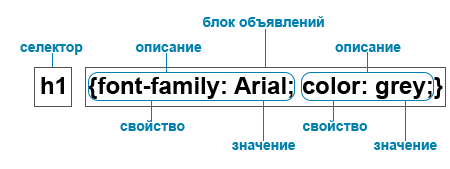
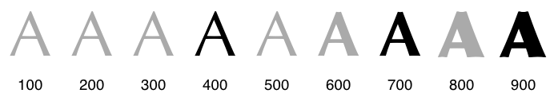
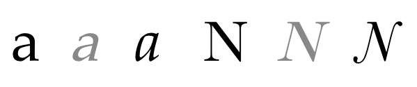

# CSS

**CSS** - язык таблиц стилей, который позволяет прикреплять стиль к документам HTML.

Если коротко он предназначен для стилизации все элементов документа.

## Как подключить стили

### Подключение в файле HTML
Мы можем подключить стили при помощи тега `<style>` в самом HTML-файле:

```html
<style>
    ...
</style>
```

Такой способ бывает полезным, но зачастую не используется

### Подключение через сторонний файл

Мы можем подключить стили из стороннего файла при помощи тега `<link>`. Этому тегу необходимо указать значения для двух атрибутов - `rel` и `href`. Сам тег должен находиться между тегами `<head>`, так как это не влияет на отображение элементов на прямую:
```html
<head>
    <link rel="stylesheet" href="./style.css">
</head>
```

Зачастую используется именно такой способ

### Стили внутри атрибутов элементов

Мы можем задать стили для конкретного элемента через атрибут `style`:
```html
<p style="color: red;">Красный текст</p>
```

## Объявление (написание) стилей

Стили описываются по определенным правилам




Для начала указывается **селектор**. Это CSS-шаблон, по которому ищутся элементы, к которым необходимо применить определенные стили (например найти все теги `<p>`)

После этого открываются фигурные скобки. Все что заключено между этими фигурными скобками применяется к определенному селектору

Между фигурными скобками перечисляются **описания стилей**. Они отделяются между собой точкой с запятой. 

Каждое описание хранит в себе **свойство** и **значение**. Свойство описывает какой параметр изменить у элемента, а значение описывает как изменить.

В примере выше описывается стиль для всех заголовком первого уровня `<h1>`. Для них устанавливается шрифт Arial (свойство `font-family`) и цвет grey (свойство `color`).

### Виды селекторов

#### Селектор элемента
Селектор элемента применяется к определенным элементам, определяя их по тегу. Такой селектор включает себя просто наименование тега (как в примере выше `h1`)

#### Селектор класса
Селектор класса применяется ко всем элементам имеющим определенный класс. 
```html
<p class="red">Элемент имеющий класс</p>
```

Для такого селектора в начале указывается точка, а потом наименование класса:
```css
.red {
    color: red;
}
```

В примере выше я установил красный цвет текста для всех элементов имеющих класс `red`

>Я перечилил далеко не все виды селекторов, а только основные. На самом деле это чем-то похоже на регулярные выражения, при помощи которых ищется соответствие элементов в документе

## Стилизация шрифтов

Для стилизации шрифтов есть свой набор CSS-свойств

### Семейство шрифтов

Свойство `font-family` отвечает за выбор начертания шрифтов.

```
font-family: "Times New Roman", Georgia, Serif;
```

### Насыщенность шрифтов

Свойство `font-weight` отвечает за то, чтобы установить насыщенность шрифтов (сделать его жирным например)

```css
font-weight: normal;
font-weight: bold;
font-weight: lighter;
font-weight: bolder;
font-weight: 100;
font-weight: 200;
font-weight: 300;
font-weight: 400;
font-weight: 500;
font-weight: 600;
font-weight: 700;
font-weight: 800;
font-weight: 900;
```



### Начертание шрифта

Свойство `font-style` отвечает за начертание шрифтов (например можно установить курсив)

```css
font-style: normal;
font-style: italic;
font-style: oblique;
```


### Размер шрифта

Свойство `font-size` отвечает за размер текста. Зачастую устанавливается в пикселях.

```css
font-size: 14px;
```

Остальные свойства а так же подробности по каждому свойству можно прочитать [тут](https://html5book.ru/css-shrifty/#font-style)
