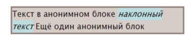
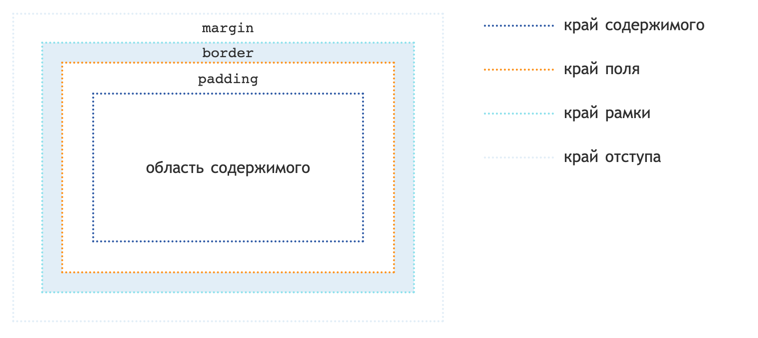

# Блочные и строчные элементы

Видимые HTML-элементы бывают двух типов - **блочными** и **строчными** элементами. 

Эти типы влияют на то как элементы будут себя вести в HTML-документе и какие свойства они имеют

## Строчные элементы

**Строчными** зачастую являются элементы отображающие текстовые данные и имеющие поведение как у текста

**Отличительные особенности:**

- Каждый новый строчный элемент **не переносится** на новую строку

    **Пример:** <span>Первый строчный элемент </span><em>Второй строчный элемент</em>
- Строчным элементам **нельзя задать отступы, ширину и высоту**
- Строчные элементы занимают место подстраиваясь под их содержимое. Если их содержимое занимает всю возможную ширину он переносится на следующую строку. Если кратко строчные элементы ведут себя как текст. На примере ниже видно как текст переносится на следующую строку:



### Встроенные строчные элементы
HTML имеет набор встроенных строчных элементов. Вот их неполный список: `<a>`, `<b>`, `<del>`, `<em>`, `<i>`, ``, `<small>`, `<span>`, `<strong>`, `<sub>`, `<sup>`

### Применение поведения через CSS

CSS-свойством указывающим что элемент должен вести себя как строчный является `display` со значением `inline`

```css
.inlineElement {
    display: inline;
}
```

## Блочные элементы

**Блочными** элементами являются элементы, которые ведут себя как блоки.

**Отличительные особенности:**
- Блоки располагаются вертикально, то есть каждый блок переносится на новую строку.

  **Пример:** <div>Первый блок</div><p>Второй блок</p>
- Блочным элементам можно задать отступы, ширину и высоту
- Блочный элемент занимает всю ширину родительского блока

  **Пример:** <div style="background: whitesmoke;">Первый блок</div><p style="background: aliceblue;">Второй блок</p>

### Встроенные блочные элементы
HTML имеет набор встроенных блочных элементов. Вот их неполный список: `<div>`, `<p>`, `<h1>-<h6>`, `<hr>`

### Применение поведения через CSS

CSS-свойством указывающим что элемент должен вести себя как блочный является `display` со значением `block`

```css
.block {
    display: block;
}
```

## Блочная модель

Блочная модель в CSS описывает свойства блочных элементов для создания отступов, границы, указания ширины и высоты

### Определение блочной модели
Каждый блок имеет область содержимого и необязательные параметры, указывающие внутренние отступы, рамку и внешние оступы



### Внешний отступ

Внешний отступ блока это отступ, который находится снаружи блока и используется для отступа от других внешних блоков.

CSS-свойством, указывающим на наличие внешнего отступа, является свойство `margin`, где значением является любое значение в пикселях или других единицах имерения:

```css
.block {
    margin: 10px;
}
```

В примере выше блок будет иметь внешние отступы в 10 пикселей со всех сторон.

Существуют так же дополнительные свойства для указания отступов с разных сторон, это `margin-left`, `margin-right`, `margin-top`, `margin-bottom`

```css
.block {
    margin-left: 10px;
    margin-right: 10px;
    margin-top: 5px;
    margin-bottom: 5px;
}
```

Блок в примере выше будет иметь вертикальный внешний отступ в 5 пикселей и горизонтальный в 10 пикселей.

Реальный пример:
<div style="background: whitesmoke;">Первый блок</div><div style="background: aliceblue; margin-top: 10px;">Второй блок</div>

### Рамка элемента

Рамка элемента задает видимую границу блока

Для указания рамки есть несколько CSS-свойств

#### Стиль рамки

За стиль рамки отвечает CSS-свойство `border-style`. Оно имеет несколько значений:

- `none` - не имеет рамки
- `dotted` - рамка из точек
- `dashed` - рамка из прочерков
- `solid` - рамка из прямой линии
- `double` - рамка из двойной линии

Есть так же и другие варианты, с ними можно ознакомиться [тут](https://html5book.ru/css-border/#border-style)

```css
div {
    border-style: solid;
}
```

#### Цвет рамки

За цвет рамки отвечает CSS-свойство `border-color`

```css
div {
    border-color: aliceblue;
}
```

#### Ширина рамки

За ширину рамки отвечает CSS-свойство `border-width`. Значение указывается в пикселях.

```css
div {
    border-width: 2px;
}
```

#### Указание рамки одним свойством

Все вышеописанные свойства можно так же задать через одно свойство `border`. Значением его является перечисление значений свойств `border-width`, `border-style` и `border-color` в заданном порядке

```css
div {
    border: 2px solid grey;
}
```

Реальный пример:
<div style="border: 2px solid orange;">Блок с рамкой</div>

### Внутренний отступ

Внутренний отступ задает отступ между содержимым и рамкой блока. 

Стоит отметить что цвет фона, указанный в блоке, применяется к области содержимого блока, внутренного отступа и области с рамкой. Внешний отступ он не затрагивает

Чтобы показать разницу между внешними и внутренними оступами я написал этот пример:
<div style="padding: 10px; background: aliceblue;">Блок с внутренним отступом</div>
<div style="margin: 10px; background: aliceblue;">Блок с внешним отступом</div>

CSS-свойством указывающим внутренние отступы является свойство `padding`. По аналогии со свойством `margin` оно имеет свойства для всех сторон блока: `padding-left`, `padding-right`, `padding-top`, `padding-bottom`

```css
div {
    padding-left: 10px;
    padding-right: 5px;
    padding-top: 6px;
    padding-bottom: 8px;
}
```
