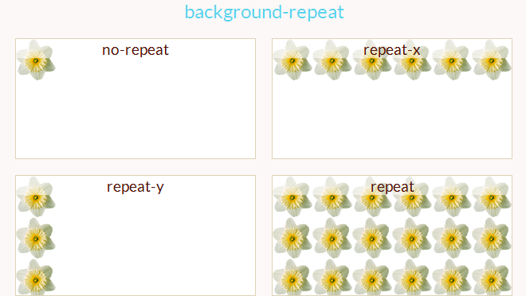
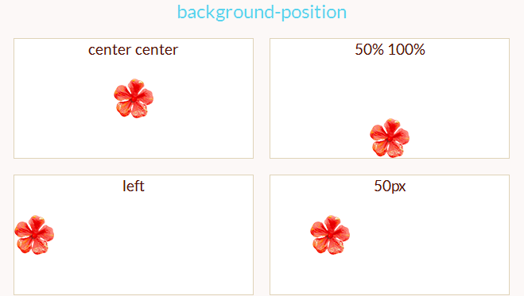
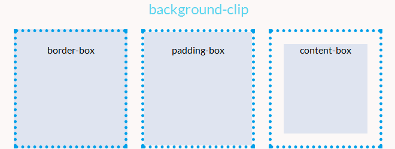
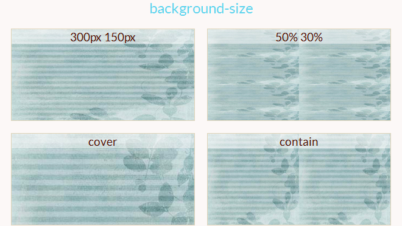

# CSS-фон

Каждый блок html-элемента имеет фоновый слой, который может быть полностью прозрачным (по умолчанию) или заполнен цветом и/или одним или несколькими изображениями.

Свойства фона не наследуются, но фон родительского блока будет просвечивать по умолчанию из-за прозрачного фона у дочерних элементов.

## Установка цвета

Свойство `background-color` устанавливает цвет фона элемента. Цвет рисуется за фоновыми изображениями. Для **блочных элементов** цвет фона распространяется на всю ширину и высоту блока элемента, **для строчных** — только на область их содержимого.

```css
background-color: salmon;
background-color: #00ff00;
background-color: rgba(255, 128, 128, 0.5);
background-color: transparent;
```

> Значение `transparent` устанавливает прозрачный фон

## Установка изображения

Свойство `background-image` устанавливает фоновое изображение (одно или несколько) элемента. 

При помощи этого свойства есть возможность установить два фоновых изображения

```css
background-image: url(http://site.ru/rose.png);
background-image: url(tl.png), url(tr.png);
```

## Укладка изображений

Свойство `background-repeat` определяет, как фоновые изображения укладываются в области фона

### Возможные значения

- `repeat-x` - Изображение повторяется в горизонтальном направлении
- `repeat-y` - Изображение повторяется в вертикальном направлении
- `repeat` - Изображение повторяется в обоих направлениях так часто, чтобы покрыть область отрисовки фона. Если изображение не помещается, оно обрезается.
- `space` - Изображение повторяется столько раз, сколько оно помещается в области фона, не обрезаясь, изображения расположены на равном расстоянии друг от друга. Первое и последнее изображения касаются краев области.
- `round` - Изображение повторяется так часто, чтобы заполнить область фона, масштабируясь и не обрезаясь
- `no-repeat` - Изображение размещается один раз и не повторяется


```css
background-repeat: repeat-x;
background-repeat: repeat-y;
background-repeat: repeat;
background-repeat: space;
background-repeat: round;
background-repeat: no-repeat;
```



## Позиционирование изображения

Если для элемента заданы фоновые изображения, свойство `background-position` указывает их начальное положение

Возможные значения: `left`, `top`, `right`, `bottom`, `center`. Расположение так же можно указать в процентах от ширины и высоты блока. 

```css
background-position: top;
background-position: bottom;
background-position: left;
background-position: right;
background-position: center;
background-position: 25% 75%;
```




## Область рисования

Свойство `background-clip` определяет область рисования фона. По умолчанию фон рисуется в области содержимого, внутреннего отступа и области рамки.

### Значения

- `border-box` - Фон закрашивает область в пределах рамки элемента. Значение по умолчанию.
- `padding-box` - Фон закрашивает область в пределах внутренних полей элемента
- `content-box` - Фон закрашивает только область содержимого.

```css
background-clip: border-box;
background-clip: padding-box;
background-clip: content-box;
```



## Размер изображений

Свойство `background-size` устанавливает размер фоновых изображений.

### Возможные значения

- `auto` - Значение по умолчанию. Высота и ширина изображения равны его оригинальным размерам.
- `cover` - Масштабирует изображение с сохранением пропорций так, чтобы его ширина или высота равнялась ширине или высоте блока.
- `contain` - Масштабирует изображение с сохранением пропорций таким образом, чтобы оно целиком поместилось внутри блока.

```css
background-size: cover;
background-size: contain;
background-size: auto;
background-size: 50%;
```


