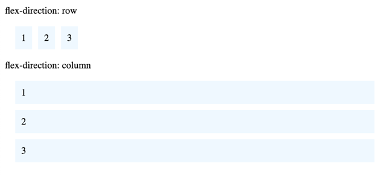
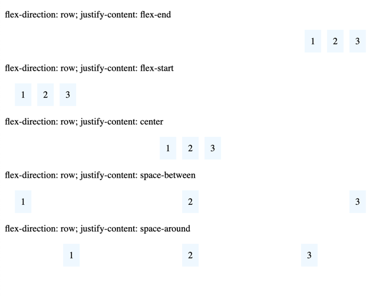
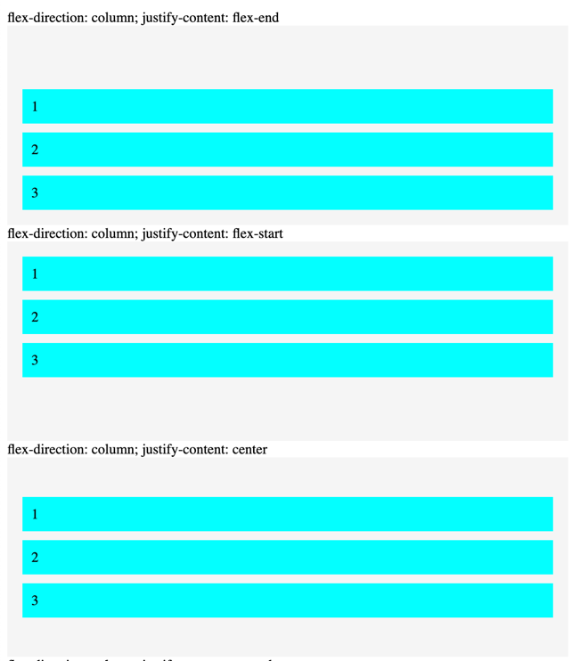

# Flexbox

**Flexbox** - технология, которая предоставляет расширенные возможности для управления поведением блоков в документе

## Зачем нужен flexbox?
- Для вертикального/горизонтального выравнивания содержимого блока
- Для оформления всех детей так, чтобы они распределили между собой доступную ширину/высоту, независимо от того, сколько ширины/высоты доступно. На примере внизу все колонки занимают ровно треть
  
- Сделать все колонки в макете одинаковой высоты, даже если наполнение в них различно. На примере выше все колонки одинаковые высоты, хотя в первых блоках меньше контента, чем в третьем

## Flex-контейнер

**Flex-контейнер** - это элемент, который включает flexbox-позиционирование для его содержимого (то есть его дочерних блоков)

Чтобы сделать блок flex-контейнером, нужно задать этому блоку CSS-свойство:
```css
.parent {
    display: flex;
}
```

В таком случае все элементы внутри этого блока будут распологаться как колонки и будут являться flex-элементами.

**Flex-элементы** — блоки, представляющие содержимое flex-контейнера.

## Порядок отображения
Содержимое flex-контейнера можно разложить в любом направлении и в любом порядке

### Направление содержимого
Свойство `flex-direction` устанавливает направление содержимого в flex-контейнере. Таким образом содержимое можно расположить как в колонку или же в строку.

Возможные значения:
- `row` - значение по умолчанию, слева направо. Flex-элементы выстраиваются в строку. 
- `row-reverse` - справа налево. Flex-элементы выкладываются в строку, но в обратном порядке
- `column` - сверху вних. Flex-элементы выкладываются в колонку
- `column-reverse` - то же что и `column` но в обратном порядке



>Все это похоже чем-то на строчные и блочные элементы. Блочные элементы выстраиваются в колонку, строчные в строки. Но в данном случае у нас нет такого разделения и мы можем применять любые блочные стили для flex-элементов.

## Выравнивание

### Выравнивание по главной оси
Свойство `justify-content` отвечает за выравнивание по главной оси flex-контейнера. 

Главной осью является то направление, в котором выкладываются flex-элементы. То есть например для свойства `flex-direction: row` главной осью является ось идущая слева направо. Следовательно если мы зададим свойство `justify-content: center` flex-элементы выравнятся посередине по горизонтали.

Возможные значения:

- `flex-start` - выравнивание по началу главной оси
- `flex-end` - выравнивание по концу главной оси
- `center` - выравнивание по центру главной оси
- `space-between` - элементы распределяются равномерно между друг другом, при этом начальный и конечный стоят у краев блока
- `space-around` - элементы распределяются равномерно между шириной содержимого блока

Примеры для строчных flex-элементов:


Примеры для колонок:


### Выравнивание по поперечной оси

Чтобы выравнить элементы по поперечной оси необходимо использовать свойство `align-items`

- `flex-start` - выравнивание по началу оси
- `flex-end` - выравнивание по концу оси
- `center` - выравнивание по центру оси

Примеры есть в `./examples/flexbox.html`
